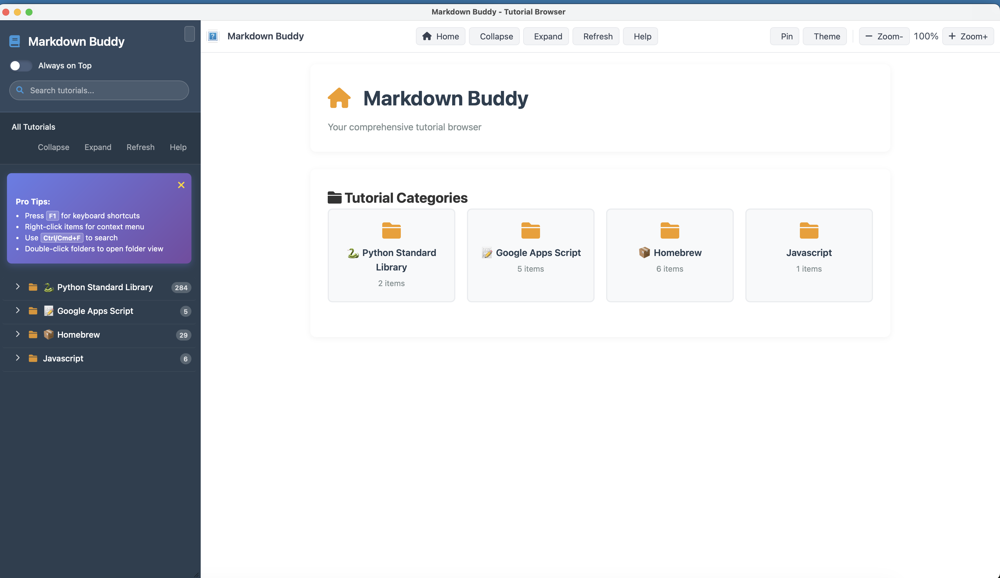
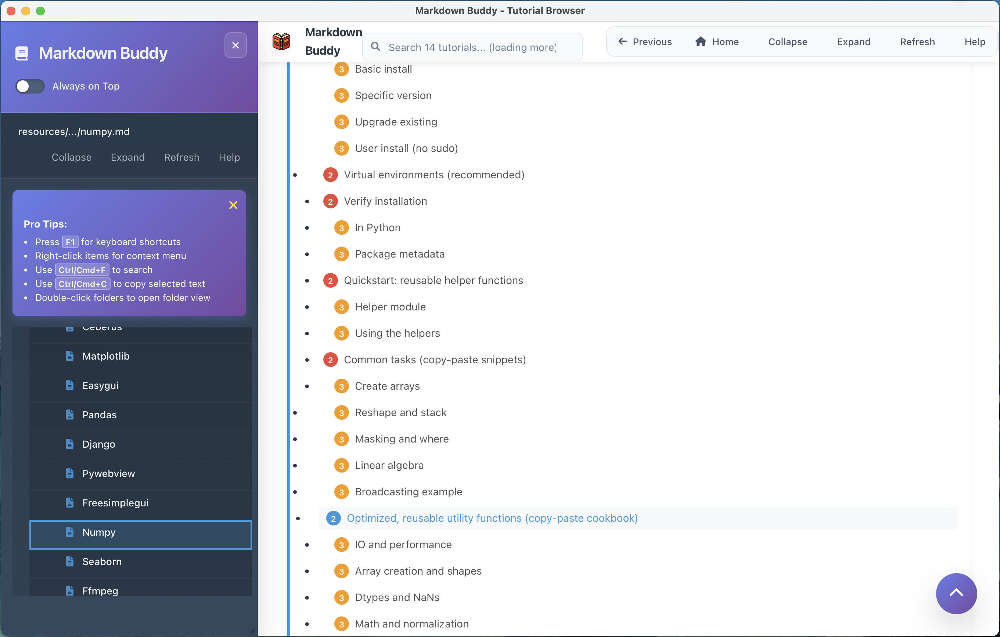

# Markdown Buddy - Advanced NeutralinoJS Tutorial Browser

A modern, feature-rich desktop application for browsing and viewing markdown-based tutorials with advanced navigation, syntax highlighting, and responsive design. This is an enhanced NeutralinoJS port of the original PHP-based [markdown_tutorials](https://github.com/codecaine-zz/markdown_tutorials) application.



## ✨ Features

### 📚 **Core Functionality**

- **Interactive Tutorial Browser** - Navigate through organized tutorial collections
- **Smart File System Integration** - Automatically scans and loads markdown files
- **Cross-Platform Native App** - Built with NeutralinoJS for Windows, macOS, and Linux
- **Offline First** - Works completely offline with local file access

### 🎨 **Rich Content Display**

- **Advanced Syntax Highlighting** - Code blocks highlighted with Highlight.js for 20+ languages
- **Auto-Generated Table of Contents** - Navigate through document sections easily
- **One-Click Code Copying** - Copy any code block with a single click
- **Smooth Anchor Navigation** - Jump to sections with smooth scrolling
- **Responsive Design** - Optimized for desktop and mobile displays

### 🧭 **Advanced Navigation System**

- **🔍 Smart Search** - Real-time search with `Ctrl/Cmd+F` shortcut
- **⌨️ Full Keyboard Navigation** - Arrow keys, shortcuts, and accessibility support
- **🎯 Context Menus** - Right-click for additional actions
- **📱 Touch-Optimized** - Mobile-friendly navigation with proper touch targets
- **🎛️ Persistent State** - Remembers folder states and preferences
- **📋 Auto-Generated TOC** - Table of contents with smooth scrolling
- **🎨 Visual Feedback** - Smooth animations and modern UI interactions

### 🪟 **Window Management**

- **Always On Top** - Keep window above all others (Cmd/Ctrl+T)
- **Native Integration** - Proper desktop app behavior
- **System Tray** - Quick access via system tray (Windows/Linux)
- **Keyboard Shortcuts** - Comprehensive shortcut system

### ♿ **Accessibility & UX**

- **ARIA Support** - Screen reader compatible
- **Focus Management** - Proper keyboard navigation
- **High Contrast** - Accessible color schemes
- **Help System** - Interactive help with F1 key

## 📸 Screenshots

### Main Application Interface


*The main interface showing the tutorial browser with enhanced navigation, syntax highlighting, and responsive sidebar*

### Advanced Application Features



*Enhanced view showcasing the expandable navigation system, deep folder structures, and improved content display*

### Smart Search Functionality


*Real-time search with instant filtering, highlighted matches, and keyboard navigation support*

## 🚀 Installation

### Prerequisites

#### Option 1: Using Node.js (Recommended)

```bash
# Install Node.js (v14+) from https://nodejs.org
# Then install NeutralinoJS CLI globally
npm install -g @neutralinojs/neu
```

#### Option 2: Using Bun (Fast & Modern)

```bash
# Install Bun from https://bun.sh
curl -fsSL https://bun.sh/install | bash

# Install NeutralinoJS CLI with Bun
bun install -g @neutralinojs/neu
```

#### Option 3: Manual Installation

1. Download NeutralinoJS CLI from [GitHub Releases](https://github.com/neutralinojs/neutralinojs-cli/releases)
2. Extract and add to your system PATH

### 📥 Quick Setup

```bash
# Clone the repository
git clone <repository-url>
cd neu_markdown_buddy

# First-time setup: Download NeutralinoJS runtime binaries
neu update

# Run in development mode
neu run

# Build for production
neu build
```

> **⚠️ Important:** Always run `neu update` first after installing NeutralinoJS CLI to download the required runtime binaries for your platform.

## 🎮 Navigation & Usage Guide

### 🔥 **Quick Start Shortcuts**

- **`F1`** - Show keyboard shortcuts help
- **`Ctrl/Cmd + F`** - Focus search box
- **`Ctrl/Cmd + H`** - Go to home
- **`Ctrl/Cmd + T`** - Toggle always on top
- **`Ctrl/Cmd + R`** - Refresh navigation
- **`Esc`** - Clear search / Close dialogs

### 🖱️ **Mouse Navigation**

- **Single Click** - Open file or expand/collapse folder
- **Double Click** - Quick expand folder or open file
- **Right Click** - Context menu with additional actions
- **Hover** - Preview file info and quick actions

### ⌨️ **Keyboard Navigation**

- **`↑` `↓`** - Navigate between items
- **`←` `→`** - Collapse/expand folders
- **`Enter`** - Open selected item
- **`Tab`** - Focus navigation between sections

### 🔍 **Search Features**

- **Real-time search** - Results appear as you type
- **Path-based search** - Find files by name, folder, or path
- **Highlighted matches** - Search terms highlighted in yellow
- **Quick clear** - Click X or press Esc to clear

### 📋 **Table of Contents**

- **Auto-generated** - Created from markdown headers
- **Color-coded levels** - Different colors for H1-H6
- **Smooth scrolling** - Click to jump to sections
- **Toggle visibility** - Show/hide with button

### 📁 **Folder Management**

- **Persistent state** - Folder open/closed states remembered
- **Batch operations** - Expand all / Collapse all buttons
- **Item counters** - Shows number of items in each folder
- **Breadcrumb navigation** - Shows current location

## 🏗️ Technology Stack

### Frontend

- **NeutralinoJS** - Lightweight cross-platform desktop framework
- **Vanilla JavaScript ES6+** - Modern JavaScript without heavy frameworks
- **Marked.js** - Fast markdown parser and compiler
- **Highlight.js** - Syntax highlighting for 20+ languages
- **Font Awesome** - Professional icons and visual elements
- **Modern CSS3** - Grid, Flexbox, animations, and responsive design

### Supported Programming Languages

```
Python, Java, PHP, JavaScript, TypeScript, C++, C#
Bash, PowerShell, SQL, JSON, YAML, XML, HTML
Docker, Go, Rust, Swift, Kotlin, Ruby, Perl
And many more...
```

## 📂 Project Structure

```
neu_markdown_buddy/
├── 📁 resources/
│   ├── 📄 index.html          # Main application HTML
│   ├── 🎨 styles.css          # Enhanced CSS with animations
│   ├── 📁 js/
│   │   └── 📄 main.js         # Advanced navigation logic
│   ├── 📁 libs/               # Third-party libraries
│   │   ├── 📄 marked.min.js
│   │   ├── 📁 highlight.js/
│   │   └── 📁 font-awesome/
│   ├── 📁 tutorials/          # Tutorial content
│   │   ├── 📁 python/
│   │   ├── 📁 homebrew/
│   │   └── 📁 google scripts/
│   └── 📁 icons/              # Application icons
├── 📁 bin/                    # Platform binaries
├── 📄 neutralino.config.json  # App configuration
└── 📄 README.md               # This file
```

## 🎯 Tutorial Categories

The application comes with comprehensive tutorial collections:

### 🐍 **Python**

- **Standard Library** - Complete Python standard library documentation
- **Data Structures** - Lists, dictionaries, sets, and more
- **Web Development** - Flask, Django, FastAPI tutorials
- **Data Science** - NumPy, Pandas, Matplotlib guides

### 🍺 **Homebrew**

- **CLI Tools** - Command-line utilities and their usage
- **Development Tools** - Programming languages and frameworks
- **Security Tools** - Network security and penetration testing
- **System Guides** - macOS tips and terminal usage

### 📊 **Google Scripts**

- **Gmail Functions** - Email automation and processing
- **Google Sheets** - Spreadsheet automation and data manipulation
- **Google Drive** - File management and organization
- **YouTube API** - Video platform integration

## 🔧 Development

### Requirements

- **Node.js** 14+ or **Bun** runtime
- **NeutralinoJS CLI** for building and running
- Modern web browser for testing

### Build Commands

```bash
# Development mode (with auto-reload)
neu run

# Build production binaries
neu build

# Clean build artifacts
neu clean

# Update dependencies
neu update
```

### Adding New Tutorials

1. Create markdown files in `resources/tutorials/[category]/`
2. Use proper heading structure (H1-H6)
3. Include code blocks with language specification
4. Add images to enhance content
5. Test navigation and search functionality

## 🌟 Key Differences from PHP Version

| Feature | PHP Version | NeutralinoJS Version |
|---------|------------|---------------------|
| **Runtime** | Requires web server | Native desktop app |
| **File Access** | Server-side only | Direct filesystem access |
| **Installation** | PHP + Composer | Single executable |
| **Performance** | Server processing | Client-side rendering |
| **Offline Usage** | Requires server | Fully offline capable |
| **Distribution** | Web deployment | Cross-platform binaries |

## Acknowledgments

- Based on the original PHP [markdown_tutorials](https://github.com/codecaine-zz/markdown_tutorials) project
- Built with [NeutralinoJS](https://neutralino.js.org/) - Lightweight cross-platform app framework
- Powered by [Marked.js](https://marked.js.org/) for markdown processing
- Syntax highlighting by [Highlight.js](https://highlightjs.org/)
- Icons by [Font Awesome](https://fontawesome.com/)

## Links

- **Original PHP Version:** https://github.com/codecaine-zz/markdown_tutorials
- **Live Demo:** https://codefreelance.net/apps/markdown_buddy/?page=home
- **NeutralinoJS Documentation:** https://neutralino.js.org/docs/

[](https://github.com/neutralinojs/neutralinojs-minimal/graphs/contributors)

## License

[MIT](LICENSE)

## Icon credits

- `trayIcon.png` - Made by [Freepik](https://www.freepik.com) and downloaded from [Flaticon](https://www.flaticon.com)
